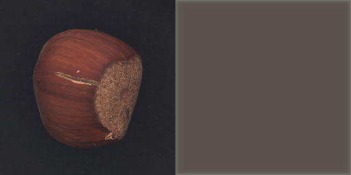
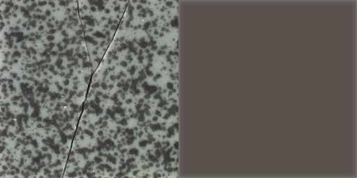
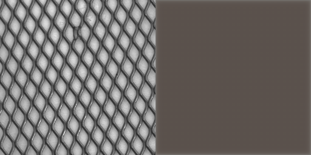

# Anomaly Detection Project - 實作日誌

這份文件記錄了 HW2: Anomaly Detection 專案的整個實作流程、決策和思考過程。

## 階段一：數據探索與基準建立 (2025-10-08)

1.  **目標**：理解數據集結構，並建立一個可以運行的基礎模型管線 (pipeline)。
2.  **數據探索**：
    *   使用 `list_directory` 工具檢查 `Dataset` 資料夾。
    *   發現數據集結構為 `Dataset/Dataset/`，且 `train` 和 `test` 資料夾內的圖片是混合所有類別的扁平結構，而非按類別分子資料夾。
    *   此結構意味著模型必須學習一個通用的「正常」表示，而不是針對特定類別。
3.  **建立 `main.py`**：
    *   創建專案主腳本 `main.py`。
    *   **程式碼結構**：
        *   `Config` 類別：集中管理所有超參數和路徑，方便調整。
        *   `set_seed()` 函數：確保實驗的可重現性。
        *   `AnomalyDataset` 類別：自定義的 PyTorch Dataset，用於讀取扁平結構的圖像資料。
        *   `UNetAutoencoder` 類別：實現計畫中的 U-Net 型自編碼器架構，包含編碼器、解碼器以及跳接。
        *   主執行區塊 (`if __name__ == "__main__":`)：搭建了數據載入、模型初始化、優化器設定，以及一個用於測試管線是否通暢的**虛擬訓練迴圈**。

## 階段二：模型診斷與數據增強 (2025-10-08)

1.  **問題分析**：
    *   執行了初步的訓練流程，發現雖然訓練損失 (Train Loss) 能正常下降，但驗證集上的 AUROC 分數始終在 0.5 左右，表示模型完全沒有學到區分正常與異常樣本的能力。
    *   **診斷**：這是一個典型現象，說明模型學到了一個「捷徑」。由於訓練數據過於單一（固定的尺寸和視角），模型只需學會重建一個「模糊的平均影像」就能降低損失，而無需學習圖像真正的、細粒度的紋理特徵。因此，當面對紋理錯位的 `CutPaste` 樣本時，其重建誤差與正常樣本沒有顯著差異。

2.  **解決方案**：
    *   **數據增強**：為了迫使模型學習更具泛化能力的紋理特徵，我們採納了計畫書中的策略，在訓練階段引入了數據增強。
    *   **具體實作**：修改了 `main.py` 中的 `train_transform`，將原本固定的 `Resize` 替換為 `transforms.RandomResizedCrop`。這會讓模型在每次訓練時都看到不同縮放、不同裁剪位置的圖像，從而無法再依賴簡單的低頻資訊作弊，必須學習到更本質的特徵。
    *   同時，將 `Config.EPOCHS` 增加到 30，給模型更長的學習時間來適應這個更困難的任務。

## 階段三：初步提交與驗證有效性確認 (2025-10-09)

1.  **目的**：使用已有模型進行一次 Kaggle 提交，以獲得真實測試集上的基準分數，並驗證內部驗證集的有效性。
2.  **執行**：我們使用僅經過 `RandomResizedCrop` 增強訓練的模型（尚未加入 `CoarseDropout`）進行推論，並將生成的 `submission.csv` 提交至 Kaggle。
3.  **結果**：Kaggle 公開排行榜分數為 **0.5277**。
4.  **結論**：
    *   這個分數與我們內部使用 `CutPaste` 偽異常驗證集得到的 AUROC 分數（約 0.5054）非常接近。
    *   **這有力地證明了我們的自監督驗證策略是有效的**。內部驗證集上的 AUROC 分數能夠很好地反映模型在真實、未見過的測試數據上的表現。這給了我們信心，未來在內部驗證集上取得的 AUROC 提升，很可能同樣會轉化為 Kaggle 分數的提升。

## 階段四：應對模型「走捷徑」問題 (2025-10-09)

1.  **問題**：綜合階段二的診斷與階段三的結果，我們確認了核心問題在於模型學會了「走捷徑」。它只學會了足以降低訓練損失的「低品質重建」（例如重建出模糊影像）技巧，而沒有學習到對「異常檢測」這個任務有用的、關於高頻紋理的精細特徵。

2.  **策略與原理**：為了打破這個僵局，我們引入了更強的數據增強方法 `CoarseDropout`。
    *   **原理**：`CoarseDropout` 會在訓練過程中，隨機地從輸入影像上「挖掉」數個矩形區塊（填上黑色）。為了要重建這些被挖掉的未知區域，模型不能再依賴簡單的模糊化，而必須去理解周圍的上下文和紋理，才能「腦補」出合理的內容。這個過程會強迫模型去學習影像的真實、高頻的細節特徵。

3.  **執行**：
    *   我們修改了 `Dataset.py`，將數據增強流程從 `torchvision` 遷移至 `albumentations` 函式庫，以便使用 `CoarseDropout`。
    *   在訓練資料的轉換流程 (`train_transform`) 中，我們在原有的 `RandomResizedCrop` 基礎上，加入了 `CoarseDropout`。

4.  **結果**：AUROC 分數仍停留在0.5左右

## 分析
換過多種方式、調整參數且經過仔細檢查，發現以上述方式訓練出的AutoEncoder AUROC仍停留在0.5左右。  
這代表目前的模型完全沒有進行有效的學習  
我仔細檢查了資料集，發現其中的物體分為15類別 
1. 拉鍊
2. 螺絲
3. 鐵網
4. 螺母
5. 瓶子
6. 藥片
7. 磁磚
8. 牙刷
9. 膠囊
10. 榛果
11. 電晶體
12. 電纜
13. 皮革
14. 木板
15. 地毯
另外，不同於手寫數字的異常偵測，此處的資料集每一個類別之間的差異的極為巨大  
個人認為，這會導致上述將所有圖片一股腦丟給AutoEncoder學習的方式反而讓模型無法很好學習到不同類別物體的特徵  
最後反而可能導致任何圖片丟給AutoEncoder重建後得到特徵相似的圖片  
AUCROC一值卡在0.5左右就是一個很好的證明，模型將所有輸入的圖片都重建成-特徵相似的圖片，自然無論正常圖片或是異常圖片，輸出模型嘔得到的圖片都會非常相似  
總結：上述方式訓練AutoEncoder根本沒辦法讓模型學會重建個個類別的圖片，只能讓模型學會將所有圖片重建成一個未知但相似的物體

## 階段五：視覺化診斷與最終結論 
1.  **目的**
    為了直觀地驗證「模型只學會重建模糊影像」的猜測，編寫了 `visualize_output.py` 腳本來觀察模型的實際輸出  
2.  **發現**
    腳本執行後，將原始影像與重建影像進行了對比  
    結果完全印證了先前的猜測：**無論輸入是什麼類別的物體，模型都只會輸出一張模糊、無法辨識的通用影像**  
    *左：原始影像 / 右：模型重建結果*
    
    
    
    
    
3.  **結論**
    這個視覺證據證明了，讓單一模型學習5種差異巨大的物體類別的策略是失敗的  
    模型為了在所有類別上都最小化重建誤差，最終選擇了「走捷徑」，即學習重建一個所有影像的「平均特徵」，從而完全喪失了對精細紋理和特定物體結構的辨識能力  
    這也完美解釋了為何AUROC分數始終無法突破0.5的隨機猜測水平  

## 後續計畫
考慮到AutoEncoder的架構都弄好了，再換其他的不太好，此處我決定先利用分類器將圖片分類，再用不同AutoEncoder重建
1. 先嘗試單類別的AutoEncoder確認有效
2. 加入分類器，將不同的圖片分類（或者手動分類）
