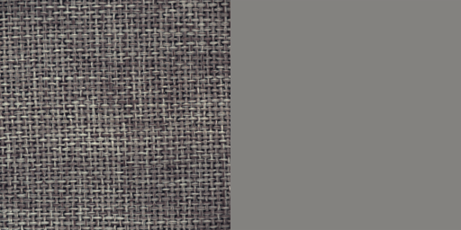

# Anomaly Detection Project - 實作日誌

這份文件記錄了 HW2: Anomaly Detection 專案的整個實作流程、決策和思考過程。

## 階段一：模型診斷與數據增強
1.  **問題分析**
    * 執行了初步的訓練流程，發現雖然訓練損失(Train Loss)能正常下降，但驗證集上的AUROC分數始終在 0.5 左右，表示模型完全沒有學到區分正常與異常樣本的能力  
    * **診斷**
        這是一個典型現象，說明模型學到了一個「捷徑」  
        由於訓練數據過於單一（固定的尺寸和視角），模型只需學會重建一個「模糊的平均影像」就能降低損失，而無需學習圖像真正的、細粒度的紋理特徵  
        因此，當面對紋紋理錯位的 `CutPaste`樣本時，其重建誤差與正常樣本沒有顯著差異  

2.  **解決方案**：
    * **數據增強**
        為了迫使模型學習更具泛化能力的紋理特徵，在訓練階段引入了數據增強  
    * **具體實作**
        修改了`main.py`中的`train_transform`，將原本固定的`Resize`替換為`transforms.RandomResizedCrop`  
        這會讓模型在每次訓練時都看到不同縮放、不同裁剪位置的圖像，從而無法再依賴簡單的低頻資訊作弊，必須學習到更本質的特徵  
    *   同時將 `Config.EPOCHS`增加到30，給模型更長的學習時間來適應這個更困難的任務  

## 階段二：初步提交與驗證有效性確認
1.  **目的**
    使用已有模型進行一次Kaggle提交，以獲得真實測試集上的基準分數，並驗證內部驗證集的有效性  
2.  **執行**
    使用僅經過`RandomResizedCrop`增強訓練的模型（尚未加入 `CoarseDropout`進行推論並將生成的 `submission.csv`提交至 Kaggle  
3.  **結果**
    Kaggle 公開排行榜分數為**0.5277**
4.  **結論**：
    *   這個分數與我們內部使用 `CutPaste` 偽異常驗證集得到的AUROC分數（約 0.5054）非常接近  

## 階段三：應對模型「走捷徑」問題

1. **問題**
    綜合階段二的診斷與階段三的結果，確認了核心問題在於模型學會了「走捷徑」 
    它只學會了足以降低訓練損失的「低品質重建」（例如重建出模糊影像）技巧，而沒有學習到對「異常檢測」這個任務有用的、關於高頻紋理的精細特徵   
2.  **策略與原理**：們引入更強的數據增強方法 `CoarseDropout`  
    * **原理**
        `CoarseDropout`會在訓練過程中，隨機地從輸入影像上「挖掉」數個矩形區塊（填上黑色） 
        為了要重建這些被挖掉的未知區域，模型不能再依賴簡單的模糊化，而必須去理解周圍的上下文和紋理，才能「腦補」出合理的內容  
        這個過程會強迫模型去學習影像的真實、高頻的細節特徵  

3.  **執行**：
    *   修改了`Dataset.py`，將數據增強流程從`torchvision`遷移至 `albumentations` 函式庫，以便使用 `CoarseDropout`  
    *   在訓練資料的轉換流程(`train_transform`) 中，在原有的`RandomResizedCrop`基礎上加入了 `CoarseDropout`  
4.  **結果**：AUROC 分數仍停留在0.5左右  

## 分析
換過多種方式、調整參數且經過仔細檢查，發現以上述方式訓練出的AutoEncoder AUROC仍停留在0.5左右  
這代表目前的模型完全沒有進行有效的學習  
我仔細檢查了資料集，發現其中的物體分為15類別：  
1. 拉鍊
2. 螺絲
3. 鐵網
4. 螺母
5. 瓶子
6. 藥片
7. 磁磚
8. 牙刷
9. 膠囊
10. 榛果
11. 電晶體
12. 電纜
13. 皮革
14. 木板
15. 地毯
另外，不同於手寫數字的異常偵測，此處的資料集每一個類別之間的差異的極為巨大  
個人認為，這會導致上述將所有圖片一股腦丟給AutoEncoder學習的方式反而讓模型無法很好學習到不同類別物體的特徵  
最後反而可能導致任何圖片丟給AutoEncoder重建後得到特徵相似的圖片  
AUCROC一值卡在0.5左右就是一個很好的證明，模型將所有輸入的圖片都重建成-特徵相似的圖片，自然無論正常圖片或是異常圖片，輸出模型嘔得到的圖片都會非常相似   
總結：上述方式訓練AutoEncoder根本沒辦法讓模型學會重建個個類別的圖片，只能讓模型學會將所有圖片重建成一個未知但相似的物體  

## 階段四：視覺化診斷與結論 
1.  **目的**
    為了直觀地驗證「模型只學會重建模糊影像」的猜測，編寫了 `visualize_output.py` 腳本來觀察模型的實際輸出  
2.  **發現**
    腳本執行後，將原始影像與重建影像進行了對比  
    結果完全印證了先前的猜測：**無論輸入是什麼類別的物體，模型都只會輸出一張模糊、無法辨識的通用影像**  
    *左：原始影像 / 右：模型重建結果*  
    
    
    
    
    
3.  **結論**
    這個視覺證據證明了，讓單一模型學習5種差異巨大的物體類別的策略是失敗的  
    模型為了在所有類別上都最小化重建誤差，最終選擇了「走捷徑」，即學習重建一個所有影像的「平均特徵」，從而完全喪失了對精細紋理和特定物體結構的辨識能力  
    這也完美解釋了為何AUROC分數始終無法突破0.5的隨機猜測水平  

## 後續計畫
考慮到AutoEncoder的架構都弄好了，再換其他的不太好，此處我決定先利用分類器將圖片分類，再用不同AutoEncoder重建
1. 先嘗試單類別的AutoEncoder確認有效
2. 加入分類器，將不同的圖片分類（或者手動分類）

## 階段五：單類別模型概念驗證-牙刷 
1.  **目的**
    驗證「為每個類別訓練專屬模型」的策略是否優於先前將所有類別混合訓練的統一模型  
    選擇「牙刷」作為第一個實驗對象，因為它的樣本數最少，最具挑戰性。 

2.  **策略**
    *  只挑選牙刷的圖片作為訓練資料投入模型
    *  沿用現有的`UNetAutoencoder`架構及`main.py`中的訓練邏輯，不作變動。
3.  **結果**
    *  根據輸出紀錄，模型在第一個Epoch的`Validation AUROC`即達到 **0.6389**  
    *  然而，從第二個 Epoch 開始，AUROC 分數迅速下降，並在0.5的隨機水準附近劇烈震盪  

4.  **結論**
    *  **假設得到驗證**
        AUROC分數在初期顯著超過0.5，這證明了先前的假設——單類別模型是正確的方向  
        模型在專注於單一類別時，確實能夠學習到區分正常與異常的有效特徵  

    *  **暴露新問題：小樣本不穩定性**
        由於牙刷的訓練樣本僅有54張，模型在極少的數據上迅速過擬合  
        這導致了後續Epoch泛化能力的喪失和驗證分數的不穩定
    *  **新的提示**
        這也帶來了一個提示，後續為每個類別的物體單獨訓練模型時，或許可以為每個物體單獨設置參數、驗證方式
            
5.  **後續步驟**
    下一步，嘗試換一個樣本數更多的類別：地毯 來重複實驗，以驗證在數據充足的情況下，訓練過程是否能更加穩定並達到更高的效能  

## 階段六：真實數據驗證與「紋理破壞」策略修正
1.  **背景**
    在「地毯」類別的訓練中，我們採用了新的「紋理破壞」(`TextureDamage`) 驗證策略，並在幾個Epoch內就達到了 `1.0` 的AUROC  
    這結果過於理想，讓我懷疑驗證任務是否過於簡單，無法反映真實的檢測能力  
2.  **目的**
    為了檢驗模型的真實實力，決定使用來自`test`資料夾中、未曾見過的真實地毯圖片（包含正常與異常）來進行一次測試  
3.  **策略**：
    *   載入AUROC達到1.0的模型  
    *   對指定的3張正常地毯圖片（`1512`, `832`, `1700`）和3張異常地毯圖片（`1144`, `640`, `97`）進行推論，並計算其異常分數  
4.  **結果**：
    *   推論分數完全無法區分正常與異常樣本。
    *   分數最高的樣本 (`1700.png`, 分數 `0.050`）反而是正常圖片  
    *   正常與異常樣本的分數區間高度重疊，模型沒有展現出任何有效的鑑別能力  

## 階段七：模型崩潰診斷與架構修復
1.  **背景**
    階段七的真實數據驗證得出了一個災難性的結果  
    一個AUROC為1.0的模型，在真實世界中卻表現得像隨機猜測一樣，個人認為有可能又出現了與先前一樣的模型根本沒有學會重建物體
2.  **發現：模型崩潰 (Model Collapse)**
    *  視覺化結果
        模型根本沒有重建任何東西，無論輸入為何，它都只會輸出一張**純灰色的圖片**  
        這完美解釋了階段七的失敗——模型並非無法分辨細微瑕疵，而是根本沒有學習影像的任何特徵  
    * *左：原始影像 / 右：模型重建結果*  
        

5.  **根本原因分析**：
    *  在審查`UNet_Autoencoder_Model.py`後，發現U-Net架構的**跳接層 (Skip Connections)**沒有加上  
    *  沒有了跳接層，所有高解析度的細節資訊都在編碼過程中遺失，解碼器無法獲得足夠的資訊來重建圖像，最終只能輸出所有像素的平均值（灰色），導致模型崩潰  
    *  此外，由於當前的驗證方式不可靠，以所謂最佳權重儲存的模型參數可能並不可靠，應該嘗試各個epoch中模型的參數，才能判斷模型有沒有學會重建

6.  **修復**：
    * 在`UNet_Autoencoder_Model.py` 中，重新連接了所有跳接層 (`torch.cat`)  
    * 同步修正了解碼器各層的輸入通道數，以匹配跳接後的新維度  
    * 新增**偵錯模式**，儲存訓練時的每個epoch的權重，逐一嘗試其真實的重建能力

## 階段八：學習歷程視覺化與最佳權重定位

1.  **目的**
    在修復U-Net架構並啟用「偵錯模式」後，透過視覺化每一輪的重建結果，來深入理解模型的學習過程，並從中手動找出最佳的模型權重。
2.  **策略**：
    * 使用修復後的模型在「偵錯模式」下完整訓練30個Epochs，並儲存所有權重  
    * 遍歷所有儲存的權重，並對固定的正常與異常測試圖片生成重建對比圖  
3.  **發現與分析**：
    * **Epoch 1 (訓練初期)**
        第一輪EPOCH，模型輸出完全灰色的方塊  
        
    * **Epoch 5 (出現變化)**
        到了第五輪EPOCH，重建出的圖片已經初步出現變化
        
    * **Epoch 10 (出現紋理)**
        到了第10輪EPOCH，重建出的圖片已經出現紋理
        
    * **Epoch 15 (學習甜蜜點)**
        此時的模型表現達到最佳  
        它能夠高度還原正常地毯的紋理細節，但對於異常圖片中的瑕疵（一個小黑點），模型無法理解因此在對應位置產生了一片模糊的重建  
        這種「對正常特徵的精通」和「對異常-特徵的無知」所造成的重建差異，正是偵測異常的核心  
        * 正常圖片重建 (Epoch 15):
            
        * 異常圖片重建 (Epoch 15):
            
    * **Epoch 30 (過擬合期)**：
        模型訓練過度  
        從重建結果看，它開始輸出純黑色的圖像，這代表模型的輸出值極度趨近於0  
        這可能是因為模型為了在有瑕疵的訓練增強數據上降低損失，學習到了一個錯誤的策略  
        此現象也與訓練日誌中，損失值在約16個epoch後不降反升的趨勢完全吻合  
        

4.  **結論**：
    *   **偵錯模式的成功**：透過「儲存所有Epoch權重」的策略，繞過了不可靠的AUROC指標，從視覺上定位到了模型的最佳狀態  
    *   **最佳權重確認**：`model_地毯_epoch_15.pth`是迄今為止得到的**重建能力最強**的權重
    *   **U-Net 架構驗證**：修復後的U-Net架構現在可以有效地學習和重建複雜的紋理特徵  

## 階段九：重建損失的量化分析與結論
1.  **目的**
    在階段八中，從視覺上判斷Epoch 15是最佳權重  
    本階段的目的是從**量化**角度，驗證這個「最佳」權重的模型，其重建損失是否真的能區分真實世界中的正常與異常樣本  
2.  **策略**：
    * 遍歷1到30所有epoch的權重  
    * 對每一個epoch的模型，都計算6張地毯測試圖片的像素級重建損失（MSE+SSIM），並將結果彙總成表格  

3.  **結果與分析**：
    * 完整的epoch分數總結表驗證了視覺上的觀察：所有圖片的重建損失在**Epoch 16**左右達到最低點，之後便開始急劇上升，證明了模型的學習在16個epoch後發生了潰  
    * 然而，最關鍵的發現是，即使在表現最好的Epoch 16，正常樣本和異常樣本的分數仍然完全混雜在一起，無法區分   
        例如，一張正常圖片 (`1512.png`) 的分數 (`0.0114`) 比三張異常圖片中的兩張還要高  

4.  **最終結論**：
    *   這次全面的量化分析給出了決定性的證據：**對於地毯這樣的複雜紋理，單純依賴像素級的重建損失，是一個不可靠的異常評分指標。**  
    *   即使模型在視覺上達到了很好的重建效果，這個重建好壞的「程度」（損失值），也無法穩定地對應到圖片是否「異常」   

5.  **下一步：轉向特徵空間**
    不再比較圖片本身，而是比較原始圖片與重建圖片兩者在模型編碼器深層所產生的「特徵」的差異  

## 階段十：特徵空間比較法
1.  **目的**
    驗證特徵空間比較策略是否能有效區分真實的正常與異常樣本  
2.  **策略**：
    *   單獨取出Encoder，以返回編碼器在瓶頸層輸出的特徵圖
    *   將異常分數的計算方式改為：**原始圖片的特徵圖**與**重建圖片的特徵圖**之間的均方誤差(MSE)  
    *   使用此新方法，遍歷所有30個 epoch 的權重，計算6張測試圖片的「特徵空間損失」  

3.  **結果與分析**：
    *   在最佳的 **Epoch 15**，結果如下表所示：  
        | 圖片 | 真實標籤 | 特徵空間分數 |
        |:---|:---|:---|
        | `1512.png` | **正常 (N)** | 1.42e-11 |
        | `640.png` | **異常 (A)** | 1.50e-11 |
        | `97.png` | **異常 (A)** | 1.50e-11 |
        | `1144.png` | **異常 (A)** | 1.59e-11 |
        | `832.png` | **正常 (N)** | 1.91e-11 |
        | `1700.png` | **正常 (N)** | 1.91e-11 |
    *   從表格中可以清晰地看到，三張異常圖片的分數被緊密地聚集在一個區間內，而正常圖片的分數則分佈在該區間的兩側  

4.  **結論**：
    * 透過在更高維度的特徵層面進行比較，可以過濾掉無關的像素級噪音，捕獲更本質的差異  
    * 但是考慮到以此方式建立出的分布，正常的資料並不集中，而是分散在異常資料的兩側，且若依照距離來進行分群，`1512.png`其實更應該被分配在異常樣本  
    * 回顧先前訓練重建地毯的模型的輸出紀錄，在15-16 Epoch，模型重建能力最好的時期達到最低  
    * 我認為或許可以利用這點，訓練各類別物件的模型，並儲存個個類型在Loss最低時的權重  
    * 用訓練好的模型的Encoder為所有正常樣本建立各類別自己的**特徵庫**並儲存  
    * 要進行異常偵測時，便將要偵測的圖片抽取特徵後與特徵庫中的對應類別特徵進行比較，並選擇其中的最小差異，與其他同類別的要偵測的圖片的最小差異進行比較  
    * 若我的猜測正確，異常樣本的分數與正常樣本的分數之間應該會存在明顯的差異  
    * 補充：由於我認為手動為test資料庫的資料分類始終不太好，所以先嘗試利用建立的特徵庫為圖片分類後計算差異，若效果不好再另做打算  

     

