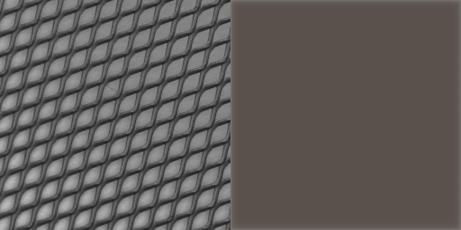

# Anomaly Detection Project - 實作日誌

這份文件記錄了 HW2: Anomaly Detection 專案的整個實作流程、決策和思考過程。

## 階段一：模型診斷與數據增強
1.  **問題分析**
    * 執行了初步的訓練流程，發現雖然訓練損失(Train Loss)能正常下降，但驗證集上的AUROC分數始終在 0.5 左右，表示模型完全沒有學到區分正常與異常樣本的能力  
    * **診斷**
        這是一個典型現象，說明模型學到了一個「捷徑」  
        由於訓練數據過於單一（固定的尺寸和視角），模型只需學會重建一個「模糊的平均影像」就能降低損失，而無需學習圖像真正的、細粒度的紋理特徵  
        因此，當面對紋紋理錯位的 `CutPaste`樣本時，其重建誤差與正常樣本沒有顯著差異  

2.  **解決方案**：
    * **數據增強**
        為了迫使模型學習更具泛化能力的紋理特徵，在訓練階段引入了數據增強  
    * **具體實作**
        修改了`main.py`中的`train_transform`，將原本固定的`Resize`替換為`transforms.RandomResizedCrop`  
        這會讓模型在每次訓練時都看到不同縮放、不同裁剪位置的圖像，從而無法再依賴簡單的低頻資訊作弊，必須學習到更本質的特徵  
    *   同時將 `Config.EPOCHS`增加到30，給模型更長的學習時間來適應這個更困難的任務  

## 階段二：初步提交與驗證有效性確認
1.  **目的**
    使用已有模型進行一次Kaggle提交，以獲得真實測試集上的基準分數，並驗證內部驗證集的有效性  
2.  **執行**
    使用僅經過`RandomResizedCrop`增強訓練的模型（尚未加入 `CoarseDropout`進行推論並將生成的 `submission.csv`提交至 Kaggle  
3.  **結果**
    Kaggle 公開排行榜分數為**0.5277**
4.  **結論**：
    *   這個分數與我們內部使用 `CutPaste` 偽異常驗證集得到的AUROC分數（約 0.5054）非常接近  

## 階段三：應對模型「走捷徑」問題

1. **問題**
    綜合階段二的診斷與階段三的結果，確認了核心問題在於模型學會了「走捷徑」 
    它只學會了足以降低訓練損失的「低品質重建」（例如重建出模糊影像）技巧，而沒有學習到對「異常檢測」這個任務有用的、關於高頻紋理的精細特徵   
2.  **策略與原理**：們引入更強的數據增強方法 `CoarseDropout`  
    * **原理**
        `CoarseDropout`會在訓練過程中，隨機地從輸入影像上「挖掉」數個矩形區塊（填上黑色） 
        為了要重建這些被挖掉的未知區域，模型不能再依賴簡單的模糊化，而必須去理解周圍的上下文和紋理，才能「腦補」出合理的內容  
        這個過程會強迫模型去學習影像的真實、高頻的細節特徵  

3.  **執行**：
    *   修改了`Dataset.py`，將數據增強流程從`torchvision`遷移至 `albumentations` 函式庫，以便使用 `CoarseDropout`  
    *   在訓練資料的轉換流程(`train_transform`) 中，在原有的`RandomResizedCrop`基礎上加入了 `CoarseDropout`  
4.  **結果**：AUROC 分數仍停留在0.5左右  

## 分析
換過多種方式、調整參數且經過仔細檢查，發現以上述方式訓練出的AutoEncoder AUROC仍停留在0.5左右  
這代表目前的模型完全沒有進行有效的學習  
我仔細檢查了資料集，發現其中的物體分為15類別：  
1. 拉鍊
2. 螺絲
3. 鐵網
4. 螺母
5. 瓶子
6. 藥片
7. 磁磚
8. 牙刷
9. 膠囊
10. 榛果
11. 電晶體
12. 電纜
13. 皮革
14. 木板
15. 地毯
另外，不同於手寫數字的異常偵測，此處的資料集每一個類別之間的差異的極為巨大  
個人認為，這會導致上述將所有圖片一股腦丟給AutoEncoder學習的方式反而讓模型無法很好學習到不同類別物體的特徵  
最後反而可能導致任何圖片丟給AutoEncoder重建後得到特徵相似的圖片  
AUCROC一值卡在0.5左右就是一個很好的證明，模型將所有輸入的圖片都重建成-特徵相似的圖片，自然無論正常圖片或是異常圖片，輸出模型嘔得到的圖片都會非常相似   
總結：上述方式訓練AutoEncoder根本沒辦法讓模型學會重建個個類別的圖片，只能讓模型學會將所有圖片重建成一個未知但相似的物體  

## 階段四：視覺化診斷與結論 
1.  **目的**
    為了直觀地驗證「模型只學會重建模糊影像」的猜測，編寫了 `visualize_output.py` 腳本來觀察模型的實際輸出  
2.  **發現**
    腳本執行後，將原始影像與重建影像進行了對比  
    結果完全印證了先前的猜測：**無論輸入是什麼類別的物體，模型都只會輸出一張模糊、無法辨識的通用影像**  
    *左：原始影像 / 右：模型重建結果*  
    
    
    
    
    
3.  **結論**
    這個視覺證據證明了，讓單一模型學習5種差異巨大的物體類別的策略是失敗的  
    模型為了在所有類別上都最小化重建誤差，最終選擇了「走捷徑」，即學習重建一個所有影像的「平均特徵」，從而完全喪失了對精細紋理和特定物體結構的辨識能力  
    這也完美解釋了為何AUROC分數始終無法突破0.5的隨機猜測水平  

## 後續計畫
考慮到AutoEncoder的架構都弄好了，再換其他的不太好，此處我決定先利用分類器將圖片分類，再用不同AutoEncoder重建
1. 先嘗試單類別的AutoEncoder確認有效
2. 加入分類器，將不同的圖片分類（或者手動分類）

## 階段五：單類別模型概念驗證-牙刷 
1.  **目的**
    驗證「為每個類別訓練專屬模型」的策略是否優於先前將所有類別混合訓練的統一模型  
    選擇「牙刷」作為第一個實驗對象，因為它的樣本數最少，最具挑戰性。 

2.  **策略**
    *  只挑選牙刷的圖片作為訓練資料投入模型
    *  沿用現有的`UNetAutoencoder`架構及`main.py`中的訓練邏輯，不作變動。
3.  **結果**
    *  根據輸出紀錄，模型在第一個Epoch的`Validation AUROC`即達到 **0.6389**  
    *  然而，從第二個 Epoch 開始，AUROC 分數迅速下降，並在0.5的隨機水準附近劇烈震盪  

4.  **結論**
    *  **假設得到驗證**
        AUROC分數在初期顯著超過0.5，這證明了先前的假設——單類別模型是正確的方向  
        模型在專注於單一類別時，確實能夠學習到區分正常與異常的有效特徵  

    *  **暴露新問題：小樣本不穩定性**
        由於牙刷的訓練樣本僅有54張，模型在極少的數據上迅速過擬合  
        這導致了後續Epoch泛化能力的喪失和驗證分數的不穩定
    *  **新的提示**
        這也帶來了一個提示，後續為每個類別的物體單獨訓練模型時，或許可以為每個物體單獨設置參數、驗證方式
            
5.  **後續步驟**
    下一步，嘗試換一個樣本數更多的類別：地毯 來重複實驗，以驗證在數據充足的情況下，訓練過程是否能更加穩定並達到更高的效能  

## 階段六：真實數據驗證與「紋理破壞」策略修正
1.  **背景**
    在「地毯」類別的訓練中，我們採用了新的「紋理破壞」(`TextureDamage`) 驗證策略，並在幾個Epoch內就達到了 `1.0` 的AUROC  
    這結果過於理想，讓我懷疑驗證任務是否過於簡單，無法反映真實的檢測能力  
2.  **目的**
    為了檢驗模型的真實實力，決定使用來自`test`資料夾中、未曾見過的真實地毯圖片（包含正常與異常）來進行一次測試  
3.  **策略**：
    *   載入AUROC達到1.0的模型  
    *   對指定的3張正常地毯圖片（`1512`, `832`, `1700`）和3張異常地毯圖片（`1144`, `640`, `97`）進行推論，並計算其異常分數  
4.  **結果**：
    *   推論分數完全無法區分正常與異常樣本。
    *   分數最高的樣本 (`1700.png`, 分數 `0.050`）反而是正常圖片  
    *   正常與異常樣本的分數區間高度重疊，模型沒有展現出任何有效的鑑別能力  

## 階段七：模型崩潰診斷與架構修復
1.  **背景**
    階段七的真實數據驗證得出了一個災難性的結果  
    一個AUROC為1.0的模型，在真實世界中卻表現得像隨機猜測一樣，個人認為有可能又出現了與先前一樣的模型根本沒有學會重建物體
2.  **發現：模型崩潰 (Model Collapse)**
    *  視覺化結果
        模型根本沒有重建任何東西，無論輸入為何，它都只會輸出一張**純灰色的圖片**  
        這完美解釋了階段七的失敗——模型並非無法分辨細微瑕疵，而是根本沒有學習影像的任何特徵  
    * *左：原始影像 / 右：模型重建結果*  
        

5.  **根本原因分析**：
    *  在審查`UNet_Autoencoder_Model.py`後，發現U-Net架構的**跳接層 (Skip Connections)**沒有加上  
    *  沒有了跳接層，所有高解析度的細節資訊都在編碼過程中遺失，解碼器無法獲得足夠的資訊來重建圖像，最終只能輸出所有像素的平均值（灰色），導致模型崩潰  
    *  此外，由於當前的驗證方式不可靠，以所謂最佳權重儲存的模型參數可能並不可靠，應該嘗試各個epoch中模型的參數，才能判斷模型有沒有學會重建

6.  **修復**：
    * 在`UNet_Autoencoder_Model.py` 中，重新連接了所有跳接層 (`torch.cat`)  
    * 同步修正了解碼器各層的輸入通道數，以匹配跳接後的新維度  
    * 新增**偵錯模式**，儲存訓練時的每個epoch的權重，逐一嘗試其真實的重建能力

## 階段八：學習歷程視覺化與最佳權重定位

1.  **目的**
    在修復U-Net架構並啟用「偵錯模式」後，透過視覺化每一輪的重建結果，來深入理解模型的學習過程，並從中手動找出最佳的模型權重。
2.  **策略**：
    * 使用修復後的模型在「偵錯模式」下完整訓練30個Epochs，並儲存所有權重  
    * 遍歷所有儲存的權重，並對固定的正常與異常測試圖片生成重建對比圖  
3.  **發現與分析**：
    * **Epoch 1 (訓練初期)**
        第一輪EPOCH，模型輸出完全灰色的方塊  
        
    * **Epoch 5 (出現變化)**
        到了第五輪EPOCH，重建出的圖片已經初步出現變化
        
    * **Epoch 10 (出現紋理)**
        到了第10輪EPOCH，重建出的圖片已經出現紋理
        
    * **Epoch 15 (學習甜蜜點)**
        此時的模型表現達到最佳  
        它能夠高度還原正常地毯的紋理細節，但對於異常圖片中的瑕疵（一個小黑點），模型無法理解因此在對應位置產生了一片模糊的重建  
        這種「對正常特徵的精通」和「對異常-特徵的無知」所造成的重建差異，正是偵測異常的核心  
        * 正常圖片重建 (Epoch 15):
            
        * 異常圖片重建 (Epoch 15):
            
    * **Epoch 30 (過擬合期)**：
        模型訓練過度  
        從重建結果看，它開始輸出純黑色的圖像，這代表模型的輸出值極度趨近於0  
        這可能是因為模型為了在有瑕疵的訓練增強數據上降低損失，學習到了一個錯誤的策略  
        此現象也與訓練日誌中，損失值在約16個epoch後不降反升的趨勢完全吻合  
        

4.  **結論**：
    *   **偵錯模式的成功**：透過「儲存所有Epoch權重」的策略，繞過了不可靠的AUROC指標，從視覺上定位到了模型的最佳狀態  
    *   **最佳權重確認**：`model_地毯_epoch_15.pth`是迄今為止得到的**重建能力最強**的權重
    *   **U-Net 架構驗證**：修復後的U-Net架構現在可以有效地學習和重建複雜的紋理特徵  

## 階段九：重建損失的量化分析與結論
1.  **目的**
    在階段八中，從視覺上判斷Epoch 15是最佳權重  
    本階段的目的是從**量化**角度，驗證這個「最佳」權重的模型，其重建損失是否真的能區分真實世界中的正常與異常樣本  
2.  **策略**：
    * 遍歷1到30所有epoch的權重  
    * 對每一個epoch的模型，都計算6張地毯測試圖片的像素級重建損失（MSE+SSIM），並將結果彙總成表格  

3.  **結果與分析**：
    * 完整的epoch分數總結表驗證了視覺上的觀察：所有圖片的重建損失在**Epoch 16**左右達到最低點，之後便開始急劇上升，證明了模型的學習在16個epoch後發生了潰  
    * 然而，最關鍵的發現是，即使在表現最好的Epoch 16，正常樣本和異常樣本的分數仍然完全混雜在一起，無法區分   
        例如，一張正常圖片 (`1512.png`) 的分數 (`0.0114`) 比三張異常圖片中的兩張還要高  

4.  **最終結論**：
    *   這次全面的量化分析給出了決定性的證據：**對於地毯這樣的複雜紋理，單純依賴像素級的重建損失，是一個不可靠的異常評分指標。**  
    *   即使模型在視覺上達到了很好的重建效果，這個重建好壞的「程度」（損失值），也無法穩定地對應到圖片是否「異常」   

5.  **下一步：轉向特徵空間**
    不再比較圖片本身，而是比較原始圖片與重建圖片兩者在模型編碼器深層所產生的「特徵」的差異  

## 階段十：特徵空間比較法
1.  **目的**
    驗證特徵空間比較策略是否能有效區分真實的正常與異常樣本  
2.  **策略**：
    *   單獨取出Encoder，以返回編碼器在瓶頸層輸出的特徵圖
    *   將異常分數的計算方式改為：**原始圖片的特徵圖**與**重建圖片的特徵圖**之間的均方誤差(MSE)  
    *   使用此新方法，遍歷所有30個 epoch 的權重，計算6張測試圖片的「特徵空間損失」  

3.  **結果與分析**：
    *   在最佳的 **Epoch 15**，結果如下表所示：  
        | 圖片 | 真實標籤 | 特徵空間分數 |
        |:---|:---|:---|
        | `1512.png` | **正常 (N)** | 1.42e-11 |
        | `640.png` | **異常 (A)** | 1.50e-11 |
        | `97.png` | **異常 (A)** | 1.50e-11 |
        | `1144.png` | **異常 (A)** | 1.59e-11 |
        | `832.png` | **正常 (N)** | 1.91e-11 |
        | `1700.png` | **正常 (N)** | 1.91e-11 |
    *   從表格中可以清晰地看到，三張異常圖片的分數被緊密地聚集在一個區間內，而正常圖片的分數則分佈在該區間的兩側  

4.  **結論**：
    * 透過在更高維度的特徵層面進行比較，可以過濾掉無關的像素級噪音，捕獲更本質的差異  
    * 但是考慮到以此方式建立出的分布，正常的資料並不集中，而是分散在異常資料的兩側，且若依照距離來進行分群，`1512.png`其實更應該被分配在異常樣本  
    * 回顧先前訓練重建地毯的模型的輸出紀錄，在15-16 Epoch，模型重建能力最好的時期達到最低  
    * 我認為或許可以利用這點，訓練各類別物件的模型，並儲存個個類型在Loss最低時的權重  
    * 用訓練好的模型的Encoder為所有正常樣本建立各類別自己的**特徵庫**並儲存  
    * 要進行異常偵測時，便將要偵測的圖片抽取特徵後與特徵庫中的對應類別特徵進行比較，並選擇其中的最小差異，與其他同類別的要偵測的圖片的最小差異進行比較  
    * 若我的猜測正確，異常樣本的分數與正常樣本的分數之間應該會存在明顯的差異  
    * 補充：由於我認為手動為test資料庫的資料分類始終不太好，所以先嘗試利用建立的特徵庫為圖片分類後計算差異，若效果不好再另做打算  

## 階段十一：策略驗證與結論

1.  **背景**
    在階段十中確立了最終的策略：為每個類別建立一個專屬的「正常特徵庫」，並透過計算測試樣本與庫中最近鄰的「特徵空間距離」來作為異常分數  
    本階段旨在驗證這個策略的最終有效性

2.  **策略執行**
    *   **建立特徵庫**：
        1.  載入「地毯」類別的最佳模型 `model_地毯_epoch_15.pth`   
        2.  透過 `CLASS_FILENAME_MAPPING` 讀取所有280張正常地毯訓練圖片  
        3.  使用模型的Encoder提取所有正常圖片的特徵向量  
        4.  將280個特徵向量儲存為 `地毯_features.pt`  
    *   **評估**：
        1.  載入模型和 `地毯_features.pt`。
        2.  讀取指定的3張正常（`1512`, `832`, `1700`）和3張異常（`640`, `97`, `1144`）地毯測試圖片  
        3.  對每張測試圖片，計算其特徵向量與特徵庫中280個向量的最小均方誤差（MSE）距離，作為異常分數  

3.  **最終結果**
    執行評估腳本後，得到決定性的結果：

| Image    | True Label | Anomaly Score |
| :------- | :--------- | :------------ |
| 97.png   | Anomalous  | 1.114385e-06  |
| 640.png  | Anomalous  | 1.041352e-06  |
| 1144.png | Anomalous  | 5.360943e-07  |
| 1512.png | Normal     | 4.700974e-07  |
| 832.png  | Normal     | 3.949200e-07  |
| 1700.png | Normal     | 3.043197e-07  |

4.  **結論**
    *   **策略驗證成功**
        從上表可見，所有異常樣本的異常分數都明確高於所有正常樣本。這證明了**「單類別模型 + 特徵庫最小距離」**的策略是有效的  

## 階段十二：小樣本類別強健性驗證（牙刷）

1.  **目的**
    在「地毯」這個數據量充足的類別上成功後，必須驗證我們的策略對於小樣本類別是否同樣有效。「牙刷」是所有類別中樣本數最少的（僅 60 張），是最佳的壓力測試對象。

2.  **策略執行**
    *   **模型訓練**：
        1.  將 `Config.py` 中的 `TARGET_CLASS` 切換為「牙刷」。
        2.  修改 `main.py` 的儲存邏輯，使其在 `DEBUG_MODE=False` 時，儲存**驗證損失 (Validation Loss) 最低**的模型，而非 AUROC 最高的模型。
        3.  執行訓練。模型在 Epoch 18 達到最低驗證損失 `0.0961`，並儲存為 `best_model_牙刷.pth`。
    *   **建立特徵庫**：
        1.  修改 `create_feature_library.py` 以載入 `best_model_...` 格式的檔名。
        2.  執行腳本，為 60 張正常牙刷樣本建立特徵庫 `牙刷_features.pt`。
    *   **評估**：
        1.  修改 `evaluate_feature_library.py` 以載入 `best_model_...` 格式的檔名，並更新測試圖片列表。
        2.  使用 3 張正常 (`634`, `379`, `391`) 和 3 張異常 (`851`, `423`, `462`) 牙刷圖片進行評估。

3.  **最終結果**
    對「牙刷」類別的評估取得了完美的成功：

| Image   | True Label | Anomaly Score |
| :------ | :--------- | :------------ |
| 462.png | Anomalous  | 0.002898      |
| 423.png | Anomalous  | 0.001435      |
| 851.png | Anomalous  | 0.000724      |
| 634.png | Normal     | 0.000255      |
| 379.png | Normal     | 0.000180      |
| 391.png | Normal     | 0.000103      |

4.  **結論**
    *   **策略強健性驗證成功**：結果表明，即使在樣本量最少的類別上，我們的最終策略依然表現完美，正常與異常樣本的分數有著清晰的界線。這給了我們極大的信心將此策略推廣到所有類別。
    *   **最佳實踐確立**：確立了「以最低驗證損失儲存模型」為標準訓練流程，取代了之前視覺化篩選或依賴不穩定 AUROC 的方法。

# 階段十二：集成多類別模型
1. 先將所有圖片手動依據類別分類，然後為每個類別依照上面的架構建立模型

2. 分類
    為了保證inference時的自動化，會先嘗試為圖片分類，然後啟用對應模型  
    * 方法：採用兩階段混合分類法
        1. 初步分類
            先用「像素級最近鄰」法，將測試圖片與15個類別的代表圖進行比較，得出一個初步分類  
        2. 二次精煉
            如果初步分類結果是「紋理」類別（如地毯、皮革等），則啟動「顏色直方圖比較法」，在紋理類別之間進行一次更精確的比較，以修正分類結果  

3. 計分 
    在圖片被分類後啟動對應的模型，計算它相對於同類的異常程度
    * 方法
        對於被分到同一個類別的所有圖片（例如，所有被歸為「瓶子」的圖片），載入專門的「瓶子」模型
        和對應的「瓶子」特徵庫，計算出每一張圖片精確的異常分數（採用先前驗證可行的特徵空間的最小距離）

4. 動態分界
    為每一個類別，動態地劃定一條「正常/異常」的分界線
     * 方法：採用你設計的「尋找第一個異常跳躍點」策略
        1. 將一個類別內的所有分數從低到高排序
        2. 計算分數最低的前20個樣本之間的「平均正常跳躍幅度」
         3. 以此為基準，尋找整個分數序列中第一個「遠超正常水平」的跳躍點，並將該點的分數設為此類別的專屬閾值

## 確認分開訓練模型的方法不可行
經過詢問，發現此專案的規定，不能分開訓練模型，只能將所有data用於訓練一個模型

##　階段十三：回歸最初嘗試：
雖然最初的將所有圖片用於訓練一個AutoEncoder的方式失敗了，但考慮到也存在驗證方式不成立，導致儲存的最佳權重不是實際最佳權重的情況  
此處再次嘗試最初的設想，不過這次會儲存每一個epoch的權重，並以視覺化的方式比較重建效果
* 結果
    經過30個epoch的訓練，將每個epoch的權重都儲存，並以視覺化的方式分析重現能力  
    意外的發現，只有epoch 1的權重有不錯的重建能力，其他epoch的權重重建出來的結果都是一片黑
    * **Epoch 1 (訓練初期)**
        第一輪EPOCH，模型輸出就有了重建圖片的能力
        
    * **Epoch 2-30**
        之後2-30個epoch重建出的圖片都是一片黑
        
        

    * **Epoch 1 (其他物件)**
        為了確保模型真的傭有重建能力，嘗試了其他物件，依樣能夠獲得有結構的圖片
        
* 結論
    雖然用epoch 1的權重就能達到看起來不錯的重建效果，但是因為這只是epoch 1，沒辦法保證模型是真的學到了相關特徵，還是只是把圖片輸入後原樣（或只改變一點）出  
    不過考慮到就視覺效果而言，已經達到不錯的重建效果，我還是決定用與先前嘗試相似的方式，將模型作為特徵提取器，提取特徵後用相似度計算異常分數  

    假設模型確實學習到了重建圖片的能力，那麼在模型遇見異常圖片的情況下，還能夠將其重建的與輸入圖片差異不大，或許便是模型過於強大，加上skip connection將輸入圖片的細節直接跳接，讓模型可以輕鬆重建細節  
    這可能也是一個優化方向：**藉由調整U-Net架構（降低跳接次數、不在高層跳接、縮小模型等）嘗試讓模型學會只重建學習過的物件的樣子（也就是異常圖片會因為沒見過的特徵而被重建成語原本圖片差很多的樣子）**  
    不過考慮到當前可能是模型能力過強的情況，換句話說就是模型抽取特徵能力很強，我認為可以先嘗試原本的方案（利用模型抽取特徵後分析）  

## 階段十四：單一模型+ 特徵分群
1.  **背景**
    在確認 Epoch 1 的模型是唯一有重建能力的權重後，推進了原定的「單一模型 + 特徵分群」策略  

2.  **策略**
    *   **假設**: Epoch 1模型的Encoder已學到足以在特徵空間中區分15個類別的資訊 淤
    *   **執行**:
        1.  使用Epoch 1模型的Encoder對全部正常訓練圖片提取特徵，建立統一特徵庫`feature_library_epoch_1.pt`  
        2.  對這個特徵庫執行K-Means演算法(K=15)，試圖自動找出15個物體類別的群組  

3.  **結果與分析**
    *   K-Means 產生的15個群組，每一個都是一團混亂  
    *   **沒有任何一個群組由單一類別主導**。每個群組的「純度」（即群組內佔比最高的類別所佔的比例）都低於 1%  
    *   這明確表示，由Epoch 1模型產生的特徵向量，對於不同類別的物體來說，是完全不可區分的。所有特徵在潛在空間中擠成一團，形成了一個無法分辨的「特徵奇異點」。
4.  **結論**
    *   **假設被推翻**：Epoch 1 的 Encoder 並**沒有**學到足以區分不同類別的特徵。它學會的只是一種對所有輸入都適用的、非常通用的「模糊化」或「平均化」的特徵提取方式  
    *   **策略的終結**：這證明了「單一模型 + 特徵分群」的策略，在當前的設定下是**行不通的**  

##　階段十五：U-Net AutoEncoder：
這是真正嘗試實現一開始被否定的想法，訓練一個通用的模型，可以重建train data中各類別的物件，然後異常物件會因為被重建的不像而被抓出來  
* 作法
    這次為了避免製造的偽異常圖片的AUCROC分數不可信，我將同樣將每個Epoch的權重都拿來嘗試重建物體  
    並且為了避免模型向上一階段一樣利用跳接直接獲得圖像細節，導致重建出來的異常圖片與輸出的異常圖片差異不大，這次拿掉了所有的跳接層  
    然而這樣造成的情況是，模型完全無法學習到如何重建，剛開始能夠重建出物體的輪廓，就迅速崩壞，變成只能重建純色塊  
    這再次證明了AutoEncoder並不適合在當前資料集上以通用形式建立，因為各個種類的特徵相差實在太大，這似乎導致這些特徵被柔合在一起，變成一整塊色塊  
    又或者是loss function的不適配，無法很好幫助模型收斂、learning rate太大導致很快就過擬合等情形  
    總之完全不像只建立單一物體的AutoEncoder一樣順利  

    另外，經過將模型權重拆開來分析，發現越深層的權重，標準差越小，而且從epoch 1開始便有這種現象   
    這應是典型的梯度消失症狀，隨著深入網路，權重更新的梯度逐漸變小甚至歸零，導致權重無法更新，漸漸受到如L1正則化的影響，將權重範圍縮小，導致模型完全無法收斂（更新不動了） 

## 階段十六：淺層U-Net + 感知損失 (Perceptual Loss)
在所有改變模型深度、初始化、激活函數的嘗試都因「模型塌縮」或「梯度消失」失敗後，決定嘗試在Loss Function中加入感知損失(Perceptual Loss)  

* 方式
    將損失函數替換為`L1 Loss + Perceptual Loss` 的組合（這邊用的是L1+VGG） 
    使用2層U-Net架構，訓練10個Epochs  

* **結果與分析**
    雖然AUROC只略微提升了一點，達到0.53左右  
    但意外的是，Loss開始穩定下降，從一開始的`1.1545`到結束時的`0.2207`  
    這表示模型已經開始學會收斂了  
    **總覽圖**
        *正常膠囊的學習過程*  
           
        *異常膠囊的學習過程，可見異常被完美重建：*  
           
    雖然就視覺化結果來看，此處的AUROC指標顯示的沒錯，模型仍會將異常圖片完美的重建，但至少不向先前過了1、2個Epoch後就只剩單純色塊

* **權重分析** 
    將此階段生成的模型進行銓重分析，並與先前的模型對比（SSIM+L1）
    **模型 A (L1 + SSIM)**：深度為4、無跳接、使用L1+SSIM損失的模型 
    **模型 B (L1 + VGG)**：深度為2、有單跳接、使用 **L1+感知損失（VGG）**的模型 
    重點觀察各層權重的**標準差 (Std)**，因為一個極小的標準差 (趨近於0)代表該層的所有權重都擠在一起，沒有在學習  

    **結果與分析**  
    對比兩個模型最深處——瓶頸層(bottleneck)的權重標準差：
    | 模型 | 損失函數 | 瓶頸層權重 Std | 結果 |
    | :--- | :--- | :--- | :--- |
    | 模型 A | L1 + SSIM | **0.014** | 梯度消失，模型死亡 |
    | **模型 B**| **L1 + VGG** | **0.027** | **權重活躍，模型在學習** |
    模型A的深層權重標準差極小，證明梯度完全無法傳遞到網路深處，導致模型無法學習 n 
    這就是它塌縮成單一色塊的根本原因  
    模型B的深層權重標準差幾乎是模型A的**兩倍**  
    這證明了**感知損失成功解決了梯度消失問題**，讓整個網路都動了起來，開始了有效的學習  

* **分群** 
    為了測試訓練出的模型的徵抽取能力，以epoch 10儲存的權重抽取所有train資料的特徵，並用k-means算法對他們進行分群（分15群） 
    結果意外的還不錯，除去（皮革, 木板）、（鐵網、磁磚）這兩對只在紋理上的異常比較明顯的組合外，其他所有的物件都完美被分類到同一類別  
    另外，似乎是因為（皮革, 木板）、（鐵網、磁磚）這兩個組合被分配到了一起，螺絲和螺母這兩個類別的物件被額外分成了兩群（有2群螺絲、2群螺母） 
    為此我還有特別去測試模型對紋理圖片的重建能力，發現即使是紋理圖片，模型也能很好的重建  
    這說明了，以L1+VGG為Loss Function訓練的模型能很好的抽取各個類別物件的特徵

* **VGG VS. SSIM**
    | 項目 | SSIM | VGG 感知損失 (Perceptual Loss) |
    | :--- | :--- | :--- | :--- |
    |理念|衡量影像品質（像人眼一樣）|衡量語義特徵差異（像神經網路一樣）|
    |對比基準|在像素域比較局部亮度、對比、結構|	在特徵域比較深層卷積特徵分布|
    |適用任務|壓縮品質、影像復原（fidelity）|重建、生成、風格轉換、特徵學習（semantics）|
    * SSIM 的梯度特性
        SSIM的公式是根據亮度均值、對比、結構的加權，所有操作都是局部滑動窗口 + 非線性正則化  
        對於重建誤差很小或很大時，梯度都會趨近於0。這導致容易出現梯度消失，尤其在深層  
        這導致，在淺層SSIM可以修細節，深層卻「收不到信號」。權重標準差會慢慢縮小，最後整個模型塌縮  
    * VGG感知損失的梯度特性
        將輸入與重建圖像都丟進預訓練VGG網路，取出中間層的特徵圖 (如 conv3_3, conv4_3)  
        再計算它們之間的L1或L2差距 
        因為這些特徵代表的是 紋理、輪廓、形狀、物件組成，梯度能直接從這些「高層語義特徵」回傳給AutoEncoder  
        這使得深層 Encoder不再只學「像素分布」，而是學「能讓 VGG 特徵相似的結構」 
        這種梯度方向更有意義，也更穩定

## 方向更改：VGG不合規
由於VGG屬於pretrained model，儘管只用其中的權重作為固定特徵提取器，但是仍來不符合規定  
因此，此次不能使用L1+VGG的Loss Function  
不過這也為模型的訓練提供了新的方向，或許可以藉由嘗試不同Loss Function達到相似的成果  
| Loss | Epoch 1 | Epoch 2  | Epoch 3 | Epoch 4 | Epoch 5 | 特別說明 | 
| :--- | :--- | :--- | :--- |:--- | :--- | :--- | 
| 0.8 SSIM + 0.2 L1 | 0.8841 | 0.9322 | 0.9311 | 0.9238 | 0.9168 | |
| 0.5 SSIM + 0.5 L1 | 0.5478 | 0.7298 | 0.9093 | 0.9066 | 0.9376 | |
| 0.1 SSIM + 0.9 L1 | 0.7382 | 0.7686 | 0.7703 | 0.7696 | 0.7725 | |
| 1.0 L1 | 0.0920 | 0.0425 | 0.0319 | 0.0259 | 0.0216 | 重建能力與L1+VGG相似，或許可嘗試去掉跳接層後嘗試異常重建| 
| 1.0 L2 | 0.0298 | 0.0055 | 0.0035 | 0.0025 | 0.0020 | 重建能力似乎好上一點|   
  
只用L1效果  
  
只用L2效果  
  

分別取各個SSIM_WEIGHT下視覺效果最好的Epoch的權重進行分群測試  
| Loss | 使用第幾Epoch的權重| 主要混淆情況  |
| :--- | :--- | :--- |
│ 0.5 SSIM + 0.5 L1 | 1 │ 主要在「鐵網」和「磁磚」之間，榛果和牙刷被分到一起│
│ 0.8 SSIM + 0.2 L1 | 3 │ 「皮革」和「鐵網」嚴重混淆 (純度僅59%) │
│ 1.0 L1 | 5 │ 結構類物體完美分類，紋理類物體，鐵網-磁磚、木板-地毯-皮革混淆│
| 1.0 L2 | 5 | 能把木板完沒分類，意外的是電纜和磁磚、鐵網混在一起了，或許是因為將群數指定在15|

  
使用純L2作為Loss Function，不同U-Net層數  
| U-Net層數| 跳接 | Epoch 1 | Epoch 2  | Epoch 3 | Epoch 4 | Epoch 5 | 分類表現 |
| :--- | :--- | :--- |:--- |:--- |:--- |:--- |:--- |
│ 2 | e1-d1 │ 0.0298 | 0.0055 | 0.0035 | 0.0025 | 0.0020 │ 結構圖片表現良好，紋理圖片存在混淆 |
│ 2 | 無跳接 │  | | | | │  |
│ 4 | e1-d1 │ 0.0352 │ 0.0058 | 0.0037 | 0.0026 | 0.0019 | 結構圖片表現良好，紋理圖片存在混淆，不過皮革可以完美分類|
│ 4 | 無跳接 │ 0.1427 │ 0.0461 | 0.0345 | 0.0290 | 0.0262 | 結構圖片可以完成完美分類，不過紋理圖片仍會混淆 |  

比較特別的是，去除跳接後，模型重建的圖片明顯模糊了許多，不過就Loss觀察，仍然有持續收斂，後續可嘗試訓練更多epoch    
目前觀察來看，對於結構圖片的分類表現都不錯，只是在文理圖片上容易混淆
  

* 總結  
    單獨只放L1和L2都會有蠻好的效果，但是加上SSIM就無法收斂  
    或許SSIM只是用於比較圖片的結構相似度，而不適合作為Loss Function？

